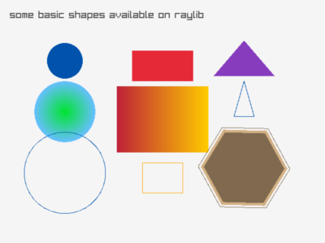

# Raylib Examples

This repository includes five examples demonstrating the use of [raylib](https://www.raylib.com) for creating 2D and 3D graphics and handling collisions.

## Examples

1. [Collision Area](#collision-area)
2. [Draw Basic Shapes 2D](#draw-basic-shapes-2d)
3. [Cubicmap Loading and Drawing](#cubicmap-loading-and-drawing)
4. [Raylib Logo](#raylib-logo)
5. [Snake Game](#raylib---classic-game-snake) 

---

### Collision Area

This example demonstrates how to handle collision areas using raylib.

---

### Draw Basic Shapes 2D

This example demonstrates how to draw basic 2D shapes using raylib, including rectangles, circles, and lines.

---

### Cubicmap Loading and Drawing

This example demonstrates how to load and draw a cubicmap using raylib.

---

### Raylib Logo

This is an example showcasing the raylib logo.

---

### Raylib - Classic Game: Snake

This is an example showcasing the sample game Snake.

You can find the original [here](https://github.com/raysan5/raylib-games/blob/master/classics/src/snake.c).

# Copyright (c) 2013-2024 Ramon Santamaria (@raysan5)
